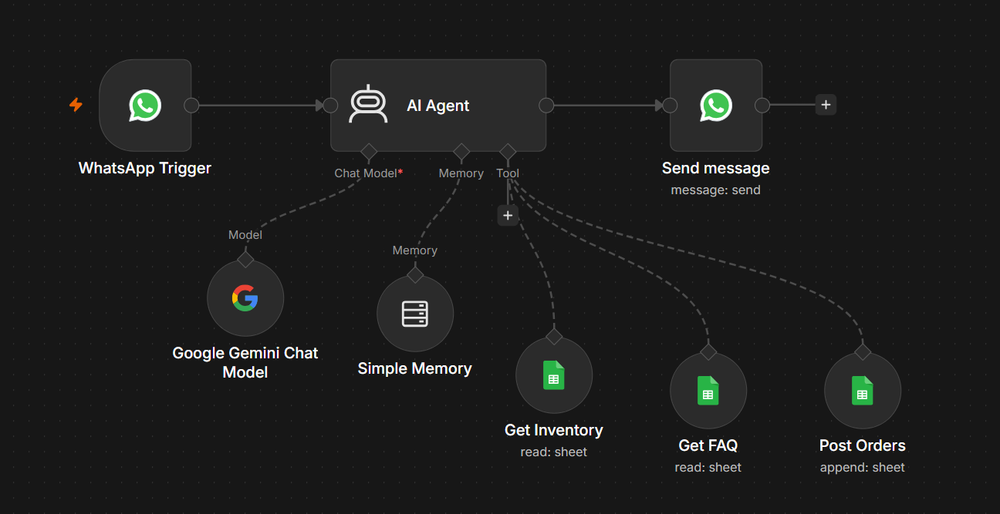

# 🤖 WhatsApp AI Restaurant Chatbot

An AI-powered WhatsApp chatbot that automates restaurant customer interactions using **n8n**, **Google Gemini API**, **WhatsApp Business API**, and **Google Sheets**.

---

## 📌 Project Overview

This chatbot enables customers to interact with a restaurant directly through WhatsApp. It can answer FAQs, check food availability, place orders, maintain conversation history, and store customer orders automatically in Google Sheets.

The entire workflow is built using **n8n** and powered by the **Google Gemini AI model**.

---

## ✨ Features

- 🍽️ AI-powered food ordering
- 📋 Restaurant FAQ support
- 📦 Real-time inventory checking
- 🛒 Automatic order management
- 📱 WhatsApp Business integration
- 🧠 Conversation memory
- 📊 Google Sheets database integration

---

## 🛠️ Tech Stack

- n8n
- Google Gemini API
- WhatsApp Business Cloud API
- Google Sheets
- AI Agent
- JSON Workflow

---

## ⚙️ Workflow

The chatbot workflow consists of the following components:

1. WhatsApp Trigger
2. AI Agent
3. Google Gemini Chat Model
4. Simple Memory
5. Inventory Management
6. FAQ Retrieval
7. Order Processing
8. WhatsApp Response

---

## 📷 Workflow Architecture

The workflow architecture is shown below.

---

## 🎥 Demo

A demonstration video of the chatbot is included in this repository.

File:

chatbot-demo.mp4

---

## 📁 Project Files

- restaurant-ai-chatbot-workflow.json
- workflow.png
- chatbot-demo.mp4

---

## 🚀 Future Improvements

- Payment Gateway Integration
- Order Tracking
- Live Delivery Status
- Voice Message Support
- Multi-language Support

---

## 👨‍💻 Author

**Shlok Topaliya**

Dhirubhai Ambani University (Formerly DA-IICT)
