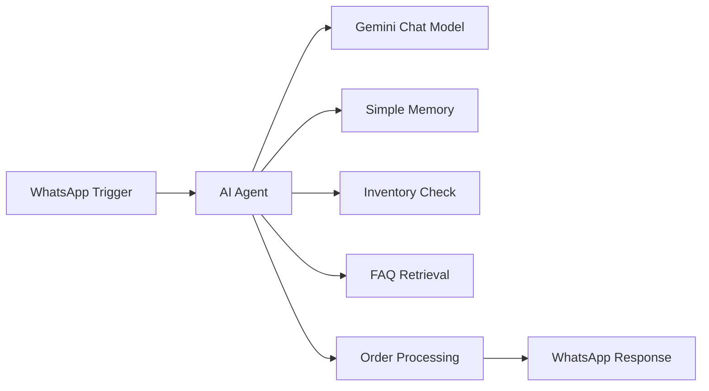

<div align="center">

# 🤖 WhatsApp AI Restaurant Chatbot

**An AI-powered WhatsApp assistant that handles restaurant orders, FAQs, and inventory — automatically.**


</div>

---

## 📌 Overview

This project automates restaurant customer service directly on WhatsApp. Customers can ask questions, check food availability, and place orders — all through natural conversation — while an **n8n** workflow powered by **Google Gemini** handles the logic and **Google Sheets** acts as the live order/inventory database.

No app to download. No forms to fill. Just a WhatsApp chat.

## ✨ Features

- 🍽️ **AI-powered ordering** — customers order in plain language
- 📋 **FAQ support** — instant answers to common restaurant questions
- 📦 **Real-time inventory checks** — no more "sorry, that's out of stock" after ordering
- 🛒 **Automatic order management** — orders logged without manual entry
- 📱 **Native WhatsApp Business integration**
- 🧠 **Conversation memory** — the bot remembers context mid-chat
- 📊 **Google Sheets backend** — zero-setup database for small restaurants

## 🛠️ Tech Stack

- **Automation:** n8n (workflow engine)
- **AI Model:** Google Gemini API
- **Messaging:** WhatsApp Business Cloud API
- **Storage:** Google Sheets
- **Architecture:** AI Agent + JSON-based workflow

## ⚙️ How It Works



1. **WhatsApp Trigger** — incoming customer message
2. **AI Agent** — interprets intent (FAQ, order, inventory check)
3. **Gemini Chat Model** — generates natural responses
4. **Simple Memory** — maintains conversation context
5. **Inventory Management** — checks live stock from Sheets
6. **FAQ Retrieval** — answers common questions
7. **Order Processing** — logs the order
8. **WhatsApp Response** — sends confirmation back to the customer

## 🎥 Demo

A full walkthrough is available in this repo: `chatbot-demo.mp4`

## 📁 Project Files

```
WhatsApp-AI-Chatbot/
├── restaurant-ai-chatbot-workflow.json   # Importable n8n workflow
├── workflow.png                          # Architecture diagram
└── chatbot-demo.mp4                      # Demo video
```

## 🚀 Setup

1. Import `restaurant-ai-chatbot-workflow.json` into your n8n instance
2. Connect your **WhatsApp Business API** credentials
3. Add your **Google Gemini API** key
4. Link a **Google Sheet** for inventory and order tracking
5. Activate the workflow and message your WhatsApp number to test

## 🚀 Roadmap

- [ ] Payment gateway integration
- [ ] Order tracking for customers
- [ ] Live delivery status updates
- [ ] Voice message support
- [ ] Multi-language support

## 👨‍💻 Author

**Shlok Topaliya**
Dhirubhai Ambani University (formerly DA-IICT)

---

<div align="center">
⭐ Found this useful? Star the repo and share it with a restaurant owner!
</div>
